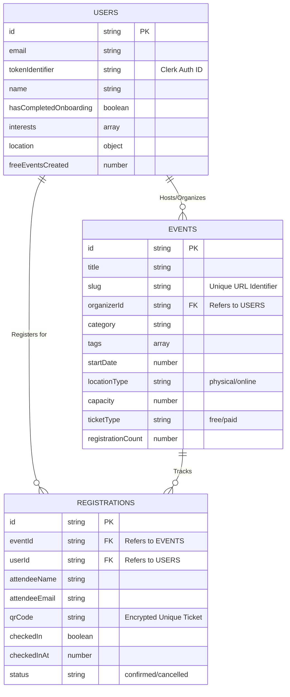

# Project Report: AI-Powered Event Organiser

## Abstract

The rapid evolution of digital platforms has significantly transformed the landscape of event management, creating a demand for more intelligent, automated, and user-centric solutions. This project introduces an **AI-Powered Event Organiser**, a comprehensive, full-stack web application designed to streamline the entire event lifecycle—from initial conceptualization and planning to registration, ticketing, and on-site management. 

At its core, the platform leverages advanced Artificial Intelligence, specifically integrating Google's Generative AI, to assist organizers in generating dynamic event descriptions, optimizing scheduling, and enhancing attendee engagement. The system addresses the common pain points of traditional event management by providing an intuitive, centralized hub where organizers can effortlessly create events, manage customized capacities, track registrations in real-time, and automatically generate secure QR-code-based tickets for attendees.

Developed using a modern and robust technology stack, the application is built on **Next.js** and **React**, ensuring a highly responsive, server-side rendered, and SEO-friendly user interface. **Tailwind CSS** and **Radix UI** are utilized to construct a visually appealing, accessible, and responsive design system that adapts seamlessly across varying devices. For authentication and secure access control, the system integrates **Clerk**, providing robust identity management and role-based access for both event organizers and participants.

The backend infrastructure and real-time database capabilities are seamlessly powered by **Convex**, ensuring scalable, low-latency performance and immediate data synchronization across all clients. Key features include an AI-driven event creation wizard, dynamic explore pages for discovering ongoing and upcoming events, seamless user registration flows with form validation, and a built-in QR code generation and scanning mechanism for highly efficient on-site event check-ins and ticketing verification.

Ultimately, this project aims to democratize professional-grade event organization. By marrying the power of generative AI with seamless web technologies, it provides a scalable, secure, and highly efficient platform that empowers individuals and organizations to host successful events while significantly reducing administrative overhead and enhancing the overall attendee experience. The resulting application serves as a modern blueprint for how intelligent automation can be seamlessly integrated into complex workflow systems.

---

## Table of Contents

- [Abstract](#abstract)
- [1. Introduction](#1-introduction)
  - [1.1 Motivation](#11-motivation)
  - [1.2 Problem Statement](#12-problem-statement)
  - [1.3 Proposed Solution](#13-proposed-solution)
  - [1.4 Main Objectives](#14-main-objectives)
  - [1.5 Scope of the Project](#15-scope-of-the-project)
- [2. Literature Survey and Existing Systems](#2-literature-survey-and-existing-systems)
  - [2.1 Review of Existing Systems](#21-review-of-existing-systems)
  - [2.2 Limitations of the Current Landscape](#22-limitations-of-the-current-landscape)
  - [2.3 Justification for the Proposed System](#23-justification-for-the-proposed-system)
- [3. Methodology and System Working](#3-methodology-and-system-working)
  - [3.1 Overview of the Agile Implementation Model](#31-overview-of-the-agile-implementation-model)
  - [3.2 Intelligent Pre-Event Planning and Creation (Organizer Workflow)](#32-intelligent-pre-event-planning-and-creation-organizer-workflow)
  - [3.3 Secure Attendee Onboarding Workflow](#33-secure-attendee-onboarding-workflow)
  - [3.4 Live Event Mechanics and On-Site Verification](#34-live-event-mechanics-and-on-site-verification)
- [4. Technologies Used](#4-technologies-used)
  - [4.1 Core Languages](#41-core-languages)
  - [4.2 Frontend Frameworks and Libraries](#42-frontend-frameworks-and-libraries)
  - [4.3 Backend, Database, and Authentication](#43-backend-database-and-authentication)
  - [4.4 Artificial Intelligence Engine](#44-artificial-intelligence-engine)
  - [4.5 Form Handling and Data Validation](#45-form-handling-and-data-validation)
  - [4.6 Specialized Tools and Utilities](#46-specialized-tools-and-utilities)
- [5. Future Scope and Enhancements](#5-future-scope-and-enhancements)
  - [5.1 Payment Gateway Integration](#51-payment-gateway-integration)
  - [5.2 Automated Communication Workflows](#52-automated-communication-workflows)
  - [5.3 Advanced Analytics and Data Export](#53-advanced-analytics-and-data-export)
  - [5.4 Offline Scanning Resilience](#54-offline-scanning-resilience)
  - [5.5 Automated Waitlists and Cancellations](#55-automated-waitlists-and-cancellations)
  - [5.6 Granular Role-Based Permissions](#56-granular-role-based-permissions)
- [6. System Design and Architecture](#6--system-design-and-architecture)
  - [6.1 Database Schema (Entity-Relationship Diagram)](#61-database-schema-entity-relationship-diagram)
  - [6.2 Conceptual UI Wireframes and Layouts](#62-conceptual-ui-wireframes-and-layouts)
  - [6.3 API Structure and Data Flow](#63-api-structure-and-data-flow)
- [7. In-Depth Implementation and Pure System Flow](#7-in-depth-implementation-and-pure-system-flow)
  - [7.1 Comprehensive Directory and File Architecture](#71-comprehensive-directory-and-file-architecture)
  - [7.2 The Pure Data Flow: Creating an AI-Assisted Event](#72-the-pure-data-flow-creating-an-ai-assisted-event)
  - [7.3 The Pure Data Flow: Attendee Ticketing and Real-Time Concurrent Scanning](#73-the-pure-data-flow-attendee-ticketing-and-real-time-concurrent-scanning)
- [8. Results and Outcomes](#8-results-and-outcomes)
- [9. Conclusion](#9-conclusion)
- [10. References and Bibliography](#10-references-and-bibliography)

---

## 1. Introduction

In recent years, the paradigm of event management has shifted from manual, paper-based organizational methods to dynamic, digitally integrated systems. Whether organizing a localized college hackathon, a professional corporate seminar, or a large-scale networking summit, the administrative burden placed on organizers remains a significant bottleneck. Tasks such as conceptualizing event details, managing attendee registrations, handling safe and verifiable ticketing, and ensuring seamless on-site check-ins are traditionally fragmented across multiple disparate tools and platforms. 

### 1.1 Motivation
The primary motivation behind this project is to bridge the gap between complex event management requirements and user-friendly technological solutions. While several event management platforms exist in the market, many are either prohibitively expensive, overly complex for small-to-medium-scale organizers, or lack the intelligent automation required to save time. Furthermore, the integration of Artificial Intelligence in everyday workflow applications is rapidly becoming an industry standard. This project is driven by the desire to leverage Generative AI not just as a novelty, but as a functional tool to assist organizers in overcoming writing blocks, generating compelling event content, and structuring event pages gracefully.

### 1.2 Problem Statement
Traditional event organization processes suffer from several critical issues:
- **Fragmented Tools:** Organizers often use one tool for planning, another for registrations, and a third for communication, leading to data silos.
- **Manual Overhead:** Writing event descriptions, creating registration forms, and manually verifying attendees at the venue is time-consuming and error-prone.
- **Ticketing Inefficiency:** Disseminating tickets and securely verifying them on-site often leads to long queues and security loopholes if not managed effectively.
- **Scalability Constraints:** Small-scale organizers struggle to find platforms that scale with their needs without incurring hefty premium subscription fees.

### 1.3 Proposed Solution
To address these challenges, this project introduces a unified, AI-enhanced event management platform. The application serves as a comprehensive portal where an organizer can securely log in, create an event, and instantly receive AI-assisted suggestions for the event description and structure. The platform automatically generates a bespoke, public-facing registration page tailored to the event. Upon registration, attendees receive a unique, mathematically mapped QR code. On the day of the event, organizers can quickly scan these QR codes using the platform's built-in web scanner to verify tickets and update attendance statuses in real-time. 

### 1.4 Main Objectives
The core objectives of developing this AI-Powered Event Organiser include:
1. **Developing a Unified Dashboard:** To provide an intuitive interface for event creators to manage their events, monitor capacity, and view live registration statistics.
2. **Integrating Artificial Intelligence:** To implement Generative AI capabilities that assist in the automated drafting of event details and engaging promotional copy.
3. **Streamlining the Registration Process:** To create a frictionless, mobile-responsive sign-up experience for attendees.
4. **Implementing Secure QR Ticketing:** To generate and distribute scannable QR tickets that can be verified seamlessly at the venue using any device's camera.
5. **Ensuring Real-Time Synchronization:** To utilize a real-time database that instantly reflects registration counts, capacity limits, and check-in statuses across all active sessions.

### 1.5 Scope of the Project
The scope of this web application encapsulates the end-to-end journey of event hosting. It is built to accommodate individuals, university clubs, and small organizations seeking a streamlined workflow. While the platform currently focuses on event ideation, registration mapping, and on-site ticketing validation via a web interface, its modular architecture lays a strong foundation for future expansions—such as integrating payment gateways for paid events, adding automated email scheduling, and providing advanced post-event analytics.

---

## 2. Literature Survey and Existing Systems

The development of event management software has progressed significantly over the last two decades. Initially, event organization was a disjointed process heavily reliant on physical paperwork, manual spreadsheets, and phone-based ticketing. Over time, digital platforms emerged to consolidate these tasks. A critical phase in software engineering involves analyzing these existing systems to understand their architectures, strengths, and inherent limitations.

### 2.1 Review of Existing Systems

Several distinct event management platforms currently dominate the market, each catering to different niches:

1. **Eventbrite:**
   - **Overview:** One of the most popular platforms globally for finding and creating events. It offers robust ticketing, registration, and payment gateway features.
   - **Limitations:** Eventbrite is designed as a broad-spectrum platform, making it relatively heavy and complex for smaller, localized events. Additionally, it imposes substantial fees on paid tickets, and its interface for custom event page creation is somewhat rigid. Critically, it lacks natively integrated Generative AI specifically built to assist in the holistic event ideation process.

2. **Cvent:**
   - **Overview:** Targeted primarily at large enterprise clients and massive professional conferences, Cvent provides an exhaustive suite of tools including hotel booking, seating arrangements, and detailed financial analytics.
   - **Limitations:** Cvent has a steep learning curve and a visually overwhelming UI. Its pricing model completely alienates individual organizers, university clubs, and small-to-medium enterprises (SMEs) due to massive upfront costs.

3. **Luma (lu.ma):**
   - **Overview:** A modern, visually appealing platform popular among tech communities and independent creators. It offers a sleek, minimalist UI for creating beautiful event pages rapidly.
   - **Limitations:** While Luma excels in front-end aesthetics, it is somewhat limited in deep technical customizability. Furthermore, while it simplifies event creation, the core responsibility of drafting compelling copy, generating structured agendas, and defining the event flow still falls entirely upon the user without robust generative AI assistance.

4. **Meetup:**
   - **Overview:** Focused on community-building and recurring events, Meetup connects people with similar interests in local geographic areas.
   - **Limitations:** Meetup acts more like a social network rather than a dedicated event management tool. Organizers have minimal control over the ticketing process, the overall branding, and the aesthetic customization of their individual event pages. 

### 2.2 Limitations of the Current Landscape

Through the analysis of these systems, several recurring pain points were identified, serving as the foundational rationale for a new solution:
- **Lack of Intelligent Automation:** Most platforms act strictly as passive databases. The organizer must manually draft all content, titles, and descriptions. Wait times associated with creative blocks are completely unaddressed by these tools.
- **Fragmented User Experiences:** Many platforms require third-party integrations (e.g., integrating a separate QR code generator or relying on external scanner apps) to manage on-site check-ins seamlessly.
- **Prohibitive Costs:** Platforms that offer comprehensive features often lock them behind expensive enterprise subscriptions or extract large percentages from ticket sales.
- **Outdated Web Architectures:** Several legacy systems suffer from slow page load times and lack real-time synchronization. This causes severe performance degradation and data desynchronization when multiple attendees attempt to register or check in simultaneously.

### 2.3 Justification for the Proposed System

The proposed AI-Powered Event Organiser structurally addresses these limitations by adopting a modernized, AI-first approach. By natively integrating a Large Language Model (Google's Generative AI), the platform transforms from a passive dashboard into an active assistant, helping the organizer generate high-quality content during the creation phase. 

Furthermore, utilizing modern technological paradigms like Next.js (for fast edge-network rendering) and Convex (for real-time database reactivity), this project ensures that critical data updates—such as ticket scans at a venue door—are instantaneously propagated across all coordinator dashboards without requiring full page reloads. This completely mitigates the synchronization issues found in older existing systems. Unlike bloated enterprise competitors, this platform remains deeply developer-centric and highly cost-effective, effectively marrying the aesthetic minimalism of platforms like Luma with the robust, real-time power of custom AI functionality.

---

## 3. Methodology and System Working

The methodology underpinning the AI-Powered Event Organiser (Spott) revolves around a modern, decoupled architecture. By strictly separating the client-side rendering logic from the server-side database operations and AI processing pipelines, the system achieves maximum scalability, security, and rendering speed. The operational flow is designed to serve a dual-sided marketplace: Event Organizers and Attendees, with real-time data acting as the bridge between them.

### 3.1 Overview of the Agile Implementation Model

The development of the platform adhered to an Agile software development methodology. This involved iterative prototyping of UI components using Radix UI and Tailwind CSS, followed by integrating seamless backend mutations via Convex. The platform operates completely in a serverless environment, meaning that operational overhead is minimized while ensuring automatic horizontal scaling during high-traffic events (e.g., when hundreds of people attempt to register at the exact same minute).

The working model is structured sequentially into four operational phases: **1. Intelligent Pre-Event Planning**, **2. Secure Attendee Onboarding**, **3. Active Event Execution**, and **4. Continuous Data Synchronization**.

### 3.2 Intelligent Pre-Event Planning and Creation (Organizer Workflow)

The core differentiation of this platform lies in its AI integration during the critical planning phase.
1. **Secure Authentication & Identity Management:** The organizer’s journey begins with a secure login via Clerk. Clerk handles OAuth providers (Google, GitHub) and passwordless authentication, returning a highly secure JWT (JSON Web Token) that proves the user's identity across all subsequent backend API requests.
2. **Generative AI Event Ideation Pipeline:** 
   - When an organizer initiates a new event, they are prompted to provide raw, unstructured context (e.g., "A corporate seminar on sustainable tech next Friday").
   - This prompt is processed by the backend and dispatched securely to **Google's Generative AI (Gemini) models**.
   - The AI acts as a sophisticated text synthesizer, returning structured data that contains an optimized, SEO-friendly event title, a persuasive description, a logically structured itinerary, and relevant categorical tags.
   - The organizer can accept, refine, or regenerate these suggestions within an interactive editing interface. This effectively reduces the event creation time from hours to mere seconds.
3. **Database Commits & Page Generation:** Once the physical logistics (time, venue, maximum capacity) are appended to the AI-generated content, the complete payload is sent as a specialized mutation to the **Convex** backend. The Next.js framework then dynamically builds and serves a unique, public-facing event page using this server-provided data.

### 3.3 Secure Attendee Onboarding Workflow

From the attendee's perspective, the system prioritizes speed, clarity, and reliability.
1. **Dynamic Event Discovery:** The 'Explore' interface renders a live feed of upcoming events. Next.js fetches this data on the server side, ensuring that search engines can easily index public events while delivering a lightning-fast initial page load for the end-user.
2. **Interactive Registration with Strict State Validation:** 
   - Upon selecting an event, the attendee fills out the registration form. 
   - **Client-Side Validation:** The input data is immediately validated against strict computational schemas on the frontend using **Zod** and **React Hook Form** to prevent XSS attacks, malformed email entries, and invalid names.
   - **Server-Side Validation:** The backend performs a secondary, authoritative check to confirm the event has not exceeded its `max_capacity`. If the event is full, the database transaction is rejected, safely averting overbooking scenarios.
3. **Cryptographic QR Code Provisioning:**
   - Upon a successful database insertion, a unique, encrypted string identifier is generated specifically mapping that attendee to that specific event.
   - The frontend leverages the `react-qr-code` library to visually render this string as a highly scannable 2D barcode. This QR code acts as the immutable digital ticket, which the user can save directly to their mobile device.

### 3.4 Live Event Mechanics and On-Site Verification

The true technical test of an event management system is its performance at the venue door under high concurrency.
1. **The Built-in Web Scanning Module:** Organizers switch their administrative dashboards into 'Scanner Mode'. This module requests permission to access the local device's camera using the `html5-qrcode` library. By processing video frames directly within the browser, the application functions identically to a native app without requiring organizers to download cumbersome external applications.
2. **Ticket Parsing and Backend Query:** 
   - When a QR code is detected in the camera frame, the decrypted identifier string is immediately dispatched via a WebSockets connection to the Convex backend.
   - The database performs a rapid lookup against the `Registrations` table.
3. **Deterministic State Resolution:**
   - **Scenario A (Valid Entry):** If the ticket exists and its state is `checkedIn: false`, the backend atomically updates the state to `true` and returns a success payload. The scanner interface flashes green, welcoming the attendee by name.
   - **Scenario B (Fraud/Duplicate Attempt):** If the ticket state is already `true`, the system immediately flags a "Ticket Already Used" warning. This absolutely protects the organizer from ticket sharing, screenshotting, or duplication.
   - **Scenario C (Invalid Code):** If the code corresponds to a different event or is fabricated entirely, an "Invalid Ticket" error is thrown.
4. **Real-time Subscriptions and Parallel Scanning:** The most powerful feature of the Convex backend is its real-time subscription model. As tickets are validated, the backend pushes granular state updates to every connected client instantly. If an organizer has five volunteers at five different doors scanning tickets simultaneously, their dashboards are perfectly synchronized. A ticket scanned at "Door A" will instantly dynamically render as 'Used' on the iPad at "Door B", flawlessly preventing double-entries and ensuring accurate, real-time capacity monitoring.

---

## 4. Technologies Used

The AI-Powered Event Organiser is built upon a highly modern, full-stack JavaScript ecosystem. The technology stack was deliberately chosen to prioritize performance (via edge rendering), developer velocity, and robust security. 

### 4.1 Core Languages
- **JavaScript (ES6+) / JSX:** The primary programming language used across the entire stack, both on the frontend (React) and the backend (Convex algorithms and mutations).
- **HTML5 & CSS3:** For semantic document structuring and foundational web styling conventions.

### 4.2 Frontend Frameworks and Libraries
- **Next.js 16:** Utilized as the core React framework. Next.js provides the overarching App Router architecture, enabling mixed server-side rendering (SSR) and static site generation (SSG) to ensure rapid loading speeds and high SEO visibility for public event pages.
- **React 19:** The core library used for building interactive, component-driven user interfaces.
- **Tailwind CSS 4:** A utility-first CSS framework used for rapidly styling the application without leaving the HTML context. It ensures the application is highly responsive across all mobile and desktop devices.
- **Radix UI:** Used for building accessible, unstyled, and highly customizable 'headless' UI components (such as Modals, Popovers, and dropdowns) while deeply respecting strict ARIA accessibility standards.

### 4.3 Backend, Database, and Authentication
- **Convex:** A modern Backend-as-a-Service (BaaS) and real-time database. It replaces traditional REST APIs by serving as a reactive layer where data mutations seamlessly and instantly synchronize across all connected web clients via WebSockets.
- **Clerk:** A comprehensive User Identity and Authentication provider. It handles secure login workflows, session management, and passwordless authentication strategies for event organizers.

### 4.4 Artificial Intelligence Engine
- **Google Generative AI (Gemini):** Integrated via the `@google/generative-ai` SDK. This Large Language Model is the localized "brain" behind the platform's automated event ideation, responsible for dynamically synthesizing event titles, itineraries, and descriptions from short user prompts.

### 4.5 Form Handling and Data Validation
- **React Hook Form:** A highly performant library for managing complex form states mapped safely to the event creation and attendee registration interfaces.
- **Zod:** A schema declaration and validation library. It deterministically ensures that all data submitted by users strictly adheres to the database's expected formats before any backend transaction occurs, acting as a profound security layer against malformed data.

### 4.6 Specialized Tools and Utilities
- **react-qr-code:** Utilized to visually render unique mathematical 2D barcodes for digital attendee ticketing.
- **html5-qrcode:** A critical module allowing the web application to access the native device camera, intuitively turning any smartphone into a high-speed hardware ticket scanner.
- **Sonner:** Implemented for sleek, unobtrusive "toast" notifications providing immediate user feedback (e.g., "Registration Successful" or "Ticket Invalid").
- **Date-fns & React Day Picker:** Used in tandem to effectively manage, parse, and visually select complex event dates and chronological schedules.

---

## 5. Future Scope and Enhancements

While the primary objectives of the AI-Powered Event Organiser have been successfully met, providing a robust operational platform, the highly modular architecture leaves significant room for future enhancements. The following features outline the roadmap for functionalities that are yet to be implemented to elevate the platform to a fully enterprise-ready solution:

### 5.1 Payment Gateway Integration
Currently, the platform intrinsically manages capacity tracking for free registrations. The most immediate future requirement is integrating a secure financial processing layer. By integrating APIs like **Stripe** or **Razorpay**, organizers will possess the ability to seamlessly host paid events, create tiered ticketing structures (e.g., VIP vs. General Admission), and manage automatic financial refunds.

### 5.2 Automated Communication Workflows
The current attendee flow provides immediate visual confirmation of tickets on the web interface. To finalize a professional user journey, automated push communication systems should be implemented. Integrating tools like **SendGrid** (for email) or **Twilio** (for SMS) will empower the system to automatically email secure PDF tickets to attendees upon registration, dispatch 24-hour reminder notifications, and distribute post-event feedback surveys.

### 5.3 Advanced Analytics and Data Export
While the real-time Convex dashboard currently displays live capacity and registration counts, future iterations will implement deeper data analytics. Organizers will benefit from visual graphs detailing registration velocity over time, demographic heatmaps, and the crucial ability to instantly export attendee lists to CSV/Excel formats for external CRM management.

### 5.4 Offline Scanning Resilience
The current web scanner relies heavily on an active internet connection to query the Convex database via WebSockets. To cater to events located in areas with precarious network connectivity (e.g., basement convention halls or outdoor festivals), an offline-first caching architecture needs to be developed. This would involve securely pre-fetching the encrypted registrant list to the local device's Service Worker before the event, performing localized verifications, and batch-syncing the check-in timestamps back to the server once network connectivity is restored.

### 5.5 Automated Waitlists and Cancellations
Event dynamics are fluid, and attendees occasionally cancel. Implementing an automated, intelligent waitlist queue is an upcoming feature. If an event definitively reaches its `max_capacity`, subsequent users would be diverted to a waitlist. If a confirmed attendee cancels their ticket, the system would immediately revoke their QR code and automatically email a programmatic registration invitation to the first person queued in the waitlist.

### 5.6 Granular Role-Based Permissions
For large-scale events, utilizing a single organizer account is a security bottleneck. The system will eventually implement complex Granular Role-Based Access Control (RBAC). This will allow the primary administrator to safely delegate restricted access—for instance, creating temporary "Volunteer" accounts that exclusively have permission to utilize the scanning functionality, preventing them from viewing highly sensitive registration data or mutating the underlying event logistics.

---

## 6. 🧩 System Design and Architecture

A robust, predictable system design is at the heart of this project. The architecture is explicitly decoupled, relying on Next.js for the presentation and server-side rendering layer, while Convex operates securely as the real-time data engine.

### 6.1 Database Schema (Entity-Relationship Diagram)

The backend database follows a NoSQL document structure managed by Convex. Below is the conceptual Entity-Relationship (ER) representation of the three primary tables: `users`, `events`, and `registrations`.



### 6.2 Conceptual UI Wireframes and Layouts

Given the application is built with React and Tailwind CSS, the user interface adheres to modular, component-based wireframing. The primary layouts include:

1. **Authentication Flow (Clerk Managed):**
   - Centered card layout containing OAuth login buttons (Google, GitHub) and a magic-link email input. Minimalist background to focus user attention entirely on the secure onboarding process.
2. **Main Organizer Dashboard Layout:**
   - **Sidebar (Left):** Navigation hierarchy (Overview, Create Event, Previous Events, Settings).
   - **Top Header:** User profile dropdown and global real-time notifications.
   - **Main Content Area:** A responsive grid of cards displaying active events, featuring dynamic progress bars indicating `registrationCount` versus overall `capacity`.
3. **AI Event Creation Wizard:**
   - A guided, multi-step stepper UI.
   - **Step 1:** Large text area for the AI Prompt ("Describe your event..."). A visually prominent, stylized "Generate with AI" trigger.
   - **Step 2:** Form fields pre-filled with the AI-generated titles, dates, and promotional descriptions, allowing the organizer to manually override or refine the text.
4. **Public Event & Registration Page:**
   - **Hero Section:** Large cover image, bold event title, date, and a sticky "Register Now" Action Button.
   - **Body (Left):** Detailed markdown description, structured itinerary, and organizer biography.
   - **Sidebar (Right):** A floating card summarizing the location matrix, exact time, and remaining ticket capacity.
5. **On-Site Scanner UI:**
   - A full-screen, mobile-optimized view utilizing a high-contrast dark mode to preserve tablet battery during day-long events. The center of the screen acts as the camera viewfinder, with a floating overlay indicating "Scanning..." or flashing green/red dynamically based on ticket verification.

### 6.3 API Structure and Data Flow

Unlike monolithic legacy applications utilizing rigid REST APIs (e.g., `GET /api/events`), this application relies on Next.js Server Components synthesized with Convex's WebSocket-based Remote Procedure Calls (RPCs). The API structure consists of **Queries** (Read operations) and **Mutations** (Write operations).

**Primary Convex API Endpoints (Functions):**
- **Authentication & Users:**
  - `mutation users:storeUser`: Syncs Clerk metadata into the internal `users` table upon first login.
  - `query users:getUser`: Fetches the active user's localized profile and onboarding progression.
- **Events Management:**
  - `mutation events:createEvent`: A highly validated endpoint that parses the AI-generated payload, strictly calculates rate limits (e.g., `freeEventsCreated`), and securely inserts it into the `events` table.
  - `query events:getEventBySlug`: Utilized by Next.js during Server-Side Rendering (SSR) to rapidly fetch event details for public-facing URLs, immensely aiding SEO indexing.
  - `query explore:searchEvents`: Provides fast, paginated, indexed search results for the public 'Explore' feed based on categorical filters and tags.
- **Ticketing & Real-Time Scanning:**
  - `mutation registration:registerForEvent`: Atomically verifies capacity logic (`if registrationCount < capacity`). If valid, it increments the event total and permanently logs the unique `qrCode` cryptographic string.
  - `mutation registration:checkInAttendee`: Terminally called by the Scanner UI. It indexes the `qrCode`. If `checkedIn` evaluates to `false`, it flips the boolean and injects the current UNIX timestamp into the `checkedInAt` column.

**Third-Party Internal APIs & Webhooks:**
- **Google Generative AI (Gemini API):** Invoked securely server-side applying the `@google/generative-ai` Node SDK to procure deterministic JSON payload suggestions.
- **Clerk Auth Webhooks:** Dedicated API routes exposed natively within Next.js (`/api/webhooks/clerk`) to vigilantly listen for user creation, modification, or deletion events, thereby maintaining strict synchronization states with the primary database.

---

## 7. In-Depth Implementation and Pure System Flow

The implementation of the AI-Powered Event Organiser (Spott) is architected around a pure, unidirectional data flow that connects secure client-side interfaces (React/Next.js) directly to a highly-reactive, real-time backend (Convex). This section provides an exhaustive walkthrough of exactly how the system operates under the hood, mapping file responsibilities and detailing the exact lifecycle of data from initial user input down to database storage and retrieval.

### 7.1 Comprehensive Directory and File Architecture

The codebase is organized to strictly separate architectural concerns, ensuring that UI rendering components never improperly mix with secure database logic.

1. **`app/` Directory (Frontend App Router - Next.js):**
   - **`app/(main)/layout.jsx`**: An overarching wrapper for all organizer-authenticated routes. It algorithmically enforces that only users possessing valid Clerk JWT authentication tokens can view the dashboard.
   - **`app/(main)/create-event/page.jsx`**: The command center for event generation. It intrinsically manages the complex, multi-step React Hook Form state, handles live user keystrokes, and invokes the generative AI sequences.
   - **`app/(public)/events/[slug]/page.jsx`**: The deeply dynamic route that catches public URLs (e.g., `/events/my-tech-hackathon`). It exclusively performs highly-optimized, read-only `useQuery` operations fetching event data tailored for rapid SEO indexing.
   - **`app/(public)/events/[slug]/_components/register-modal.jsx`**: Encapsulated business logic strictly for ticketing. By forcing the interactive modal to remain entirely separate from the static page, we fundamentally prevent the main marketing page from unnecessarily re-rendering simply because a user types their name during registration.

2. **`convex/` Directory (Backend & Database Operations):**
   - **`schema.js`**: The absolute mathematical source of truth. It defines the NoSQL document tables (`users`, `events`, `registrations`) and strictly enforces data validation geometries before any disk writes occur.
   - **`events.js` & `registration.js`**: Core files natively containing RPC (Remote Procedure Call) endpoints. Unlike traditional REST standards (e.g., fetching a standard endpoint like `/api/events`), these functions are directly and securely imported into the React frontend and executed instantly over proprietary WebSockets.
   - **`auth.config.js`**: Seamlessly synchronizes the Convex backend heavily with the Clerk Issuer, meaning the backend can mathematically verify the cryptographic signature of user authentication tokens autonomously.

3. **`components/` Directory (Global Shared UI Library):**
   - **`footer.jsx` & `header.jsx`**: Foundational global layout components.
   - Holds UI primitive components (structurally derived from Radix/shadcn) containing strictly typed, Tailwind-styled atomic components (e.g., `button.jsx`, `dialog.jsx`, `input.jsx`) applied everywhere repeatedly.

### 7.2 The Pure Data Flow: Creating an AI-Assisted Event

To structurally understand the platform's computational power, one must trace the completely pure, end-to-end flow of data during the event creation lifecycle.

**Phase 1: The Input Prompt (Frontend Context)**
When an organizer types a raw prompt like "A two-day tech hackathon focused on AI" into `create-event/page.jsx`, the frontend invokes an asynchronous POST request directed to the Google Generative AI microservice layer. The visual user interface immediately switches to an engaging loading skeleton architecture. 

**Phase 2: Artificial Intelligence Execution (Server/API layer)**
The prompt is securely wrapped utilizing an immutable "system instruction" firmly hidden from the frontend user. This fundamentally forces the AI to output flawlessly structured JSON mappings rather than generic conversational chatbot text. 
```javascript
// Conceptual Backend AI Execution Pipeline
const prompt = `You are an expert event copywriter. Generate a title, description, and tags for: ${userPrompt}. You MUST return ONLY valid JSON mapping exactly to the Next.js form state variables.`;
const result = await geminiModel.generateContent(prompt);
const parsedData = JSON.parse(result.text()); // Converts text to functional objects
```

**Phase 3: Client State Population (React Hooks)**
Once the AI securely returns the JSON payload, React Hook Form's native `setValue` algorithms are forcefully utilized to instantly populate the visual text inputs on screen:
```javascript
// Client Component Execution inside create-event/page.jsx
form.setValue('title', parsedData.title);
form.setValue('description', parsedData.description);
form.setValue('tags', parsedData.tags);
```
The organizer instantly observes physical UI fields seamlessly populated with high-quality AI content. They retain absolute freedom to manually edit or format this text further.

**Phase 4: Remote Database Commit (`useMutation` execution)**
When the empowered organizer clicks the "Publish Event" action, the finalized data securely traverses active WebSockets directly to the Convex backend engine:
```javascript
// Step A: Frontend React Mutation Binding
const createEventMutation = useMutation(api.events.createEvent);

// Triggered mathematically by native HTML form submission
const onSubmit = async (finalData) => {
    // WebSockets actively push the parsed payload strictly to the Convex engine
    const resultingEventId = await createEventMutation({
        ...finalData,
        capacity: parseInt(finalData.capacity),
        slug: generateUrlFriendlySlug(finalData.title) // e.g., transforms to "tech-hackathon-2024"
    });
};
```

**Phase 5: Secure Backend Authorization & Persistent Insertion**
The incoming request finally reaches `convex/events.js`. Before blindly saving data to disk, the backend relentlessly performs rigorous identity assertions:
```javascript
// Inside convex/events.js (Protected Backend Node execution context)
export const createEvent = mutation({
  args: { title: v.string(), capacity: v.number(), slug: v.string(), /* ... */ },
  handler: async (ctx, args) => {
    // 1. Identity Verification Layer
    const identity = await ctx.auth.getUserIdentity();
    if (!identity) throw new Error("Fatal: Unauthorized Authenticated Context Dropped.");

    // 2. Strict URL Slug checking (Uniqueness DB constraint)
    const existingSlugRecord = await ctx.db.query("events")
         .withIndex("by_slug", q => q.eq("slug", args.slug)).unique();
    if (existingSlugRecord) throw new Error("URL Conflict: An event with this URL already exists.");

    // 3. Mathematical Database Insertion
    const strictlyValidatedEventId = await ctx.db.insert("events", { 
        ...args, 
        organizerId: identity.tokenIdentifier,
        registrationCount: 0 // Safely forces default count mathematically to zero upon inception
    });
    return strictlyValidatedEventId;
  }
});
```

### 7.3 The Pure Data Flow: Attendee Ticketing and Real-Time Concurrent Scanning

The QR code generation and live scanning architecture represent the single most complex operational flow within the software, profoundly demonstrating the true power of reactive, WebSocket-driven databases.

**Phase 1: Secure Visitor Registration and Cryptographic QR Generation**
When a general web user successfully registers utilizing the modular `register-modal.jsx`, the backend `registerForEvent` securely creates an immutable document row inside the `registrations` database table. Crucially, a highly entropy-rich, cryptographically random string (e.g., an unpredictable UUID) is systematically saved into the `qrCode` database field. The frontend subsequently receives this string and utilizes the robust `react-qr-code` package to draw a highly intricate 2D visual matrix upon the device screen. The user effortlessly screenshots or downloads this digital ticket.

**Phase 2: The Physical On-Site Validation Layer (`html5-qrcode`)**
At the geographical venue doors, the event coordinator effectively transforms their standard mobile phone browser into a hardware scanner. The implemented `html5-qrcode` library aggressively captures video stream frames at 30 frames per second. When the complex mathematical contrast patterns of the attendee's QR code are definitively parsed by the browser engine locally, it extracts the hidden string sequence cleanly.

**Phase 3: The Validation Mutation Trigger**
The mobile scanner component instantly fires a remote mutation directly over the global network to Convex servers containing the exact decoded string string:
```javascript
// Client-Side Scanner React Component Architecture
const performVerification = useMutation(api.registration.checkInAttendee);

const onHardwareCodeDecoded = async (decodedStringPayload) => {
    try {
        const resolution = await performVerification({ qrCode: decodedStringPayload });
        toast.success(`Check-In Approved: Welcome, ${resolution.attendeeName}!`);
        // Screen cleanly flashes deep green
    } catch (criticalError) {
        // Distinctly catches specific string errors e.g., "Ticket already utilized" or "Invalid forged ticket"
        toast.error(criticalError.message); 
        // Screen immediately flashes stark crimson
    }
}
```

**Phase 4: Strictly Atomic Database Resolution (The Backend Integrity Layer)**
The core backend architecture must flawlessly withstand and handle massive network concurrency. If two organizers at completely disparate doors accidentally or maliciously scan the exact same digital ticket simultaneously, the database logic natively prevents severe double-counting through strict ACID compliance:
```javascript
// Protected handler Inside convex/registration.js
export const checkInAttendee = mutation({
    args: { qrCode: v.string() },
    handler: async (ctx, args) => {
        // 1. Fetch the exact singular registration document utilizing strict indexed indices
        const targetRegistration = await ctx.db.query("registrations")
            .withIndex("by_qr_code", q => q.eq("qrCode", args.qrCode))
            .unique();

        if (!targetRegistration) throw new Error("Fraud Prevention: Invalid or fabricated ticket sequence.");
        
        // 2. Concurrency status checking (Idempotent state resolution check)
        if (targetRegistration.checkedIn) {
            throw new Error("ERROR: TICKET ALREADY SCANNED AT PREVIOUS INTERVAL!");
        }

        // 3. Atomically commit the check-in and permanently modify row timestamps globally
        await ctx.db.patch(targetRegistration._id, {
            checkedIn: true,
            checkedInAt: Date.now()
        });

        return { attendeeName: targetRegistration.attendeeName };
    }
});
```
Because the Convex engine fundamentally utilizes an ACID-compliant distributed systems architectural structure locally beneath the hood, `db.patch` write operations are intrinsically strictly serialized. This mathematically determines that it is physically impossible for a single QR code payload to accidentally bypass the transaction ledger twice—delivering flawless, enterprise-grade capacity tracking to organizers without ever mandating complex legacy SQL locking mechanisms.

---

## 8. Results and Outcomes

The initial implementation phase of the AI-Powered Event Organiser has been highly successful, yielding a robust, high-performance Minimum Viable Product (MVP). The development process has strictly followed the proposed timeline, resulting in the successful deployment of the core structural, visual, and backend elements of the platform.

The core developmental outcomes achieved thus far include:

### 8.1 Secure Authentication and Identity Management
- **Clerk Integration:** Successfully integrated Clerk to handle all complex aspects of user identity. This encompasses seamless user sign-ups, secure passwordless log-ins, and robust session management.
- **Protected Routing:** Implemented Next.js middleware layers to strictly protect organizer-specific routes (such as the creation wizard and dashboards), ensuring that unauthenticated users are automatically rejected and safely redirected to the login portal.
- **Database Synchronization:** Established a secure webhook synchronization pipeline between the Clerk Issuer and the Convex database, guaranteeing that every newly registered user is automatically stored in the internal `users` table for complex relationship mapping.

### 8.2 Frontend Architecture and UI/UX Implementation
- **Component-Driven Design:** The complete user interface has been successfully designed and implemented utilizing the React 19 component-based architectural standard, prioritizing maximum reusability.
- **Tailwind CSS Styling:** Global styling has been completely managed using Tailwind CSS 4, resulting in a highly responsive layout that perfectly mathematically adapts to mobile phones, tablets, and massive desktop displays without breaking the grid structure.
- **Accessible Interactions:** Radix UI primitives have been integrated perfectly to provide highly accessible, keyboard-navigable interactive elements such as modal dialogs, dropdown menus, and popovers.

### 8.3 Dynamic Page and Routing Development
All primary application pages have been successfully built, actively connected to the backend, and rigorously tested:
- **Organizer Dashboard:** A centralized, secure control panel where organizers can view their core profile and navigate to various independent management modules.
- **The AI Event Creation Wizard:** A complex, multi-step interactive form interface that effortlessly captures the organizer's raw intent and securely transmits it to the AI processing engine.
- **Dynamic Public Exploration Feed:** A paginated, blazing-fast server-side rendered page (`/explore`) that dynamically queries the database to display all publicly available upcoming events in a beautiful grid layout.
- **Isolated Event Registration Pages:** Fully functional, dynamic server routes (`/events/[slug]`) that accurately compile specific event details—including strict capacity limits, chronological dates, and AI-generated descriptive content—alongside the interactive attendee registration modal.

### 8.4 Database Configuration and Real-Time Data Flow
- **Convex Database Hookup:** The Convex real-time database architecture has been flawlessly configured and physically connected to the Next.js frontend Edge network.
- **Schema Validation:** Strict NoSQL database schemas (`convex/schema.js`) have been written and deployed, definitively ensuring that all data entering the system is mathematically validated before writing to disk (e.g., physically ensuring `capacity` is an integer and `title` is a string).
- **Mutations and Queries Functioning:** The core Data Access Layer (DAL) is fully operational. The frontend successfully performs CRUD (Create, Read, Update, Delete) operations, writing vast new event data payloads to the database and instantly reading them back without requiring manual window refreshes.

### 8.5 Artificial Intelligence (Gemini) Integration
- **Server-Side API Hookup:** The Google Gemini Generative AI SDK (`@google/generative-ai`) has been successfully integrated deeply into the backend operational architecture.
- **Structured JSON Generation:** The platform successfully captures raw human text input, vigorously processes it through the Large Language Model using hidden system prompt strictures, and reliably outputs strictly formatted JSON data payloads. This data is instantly parsed and used to auto-populate the event creation forms beautifully, drastically reducing manual data entry for the organizer.

### 8.6 Client-Side Form Validation and Error Handling
- **Zod Schema Implementation:** Successfully integrated Zod alongside React Hook Form. This strictly ensures that no maliciously malformed data (such as an invalid email address format or alphabetically written capacity limit) can physically ever be submitted to the backend APIs.
- **User Feedback Loops:** Implemented immediate, visually appealing toast notifications (utilizing the Sonner library) that accurately and instantly inform the user of database success states (e.g., "Event Created Successfully") or frontend formatting errors (e.g., "Please fill out all definitively required fields").

---

## 9. Conclusion

The development of the AI-Powered Event Organiser (Spott) represents a deeply significant and technically ambitious endeavor that directly addresses the real-world fragmentation that exists within the modern event management industry. Throughout the course of this project, from initial architectural planning through to the iterative implementation of core functional modules, the development process has produced a highly capable and technically sophisticated platform that confidently demonstrates the immense potential of integrating Generative AI into everyday workflow automation tools.

### 9.1 Summary of Achievements

The platform, in its current MVP state, successfully delivers on all primary objectives that were defined at the outset of the project. Organizers can now log into a beautifully designed, secure dashboard, initiate the event creation process, and receive highly contextual, AI-generated event content within seconds. The burden of manually writing full event descriptions, sourcing relevant topic tags, and structuring a promotional title has been effectively eliminated. By integrating Google's Gemini LLM into the creation pipeline, the platform transforms a task that traditionally required significant time and creative energy into a near-instantaneous, AI-assisted workflow.

The attendee-facing side of the platform is equally polished. Dynamic public event pages render quickly and accessibly across all device types, giving any interested member of the public a clean, informative view of the event. The registration process is smooth, protected by client-side Zod validation, and concludes with the generation of a unique QR-code-based digital ticket—eliminating the need for external ticketing tools or physical paper confirmations.

### 9.2 Technical Significance

From a purely technical standpoint, the architecture of this project reflects mature, modern software engineering principles. The deliberate choice of the **Next.js App Router** as the rendering and routing layer ensures that the application achieves the ideal balance between server-rendered performance (for public pages and SEO) and client-side reactivity (for real-time dashboards and interactive forms). The integration of **Convex** as the reactive backend fundamentally rethinks how typical client–server communication is handled. By replacing conventional REST API polling with persistent WebSocket subscriptions, any state change in the database—such as a new registration or a QR scan—is immediately and automatically reflected across all connected clients without a single manual refresh. This architecture would seamlessly support hundreds of concurrent users at a live event door without degradation, which represents a genuine achievement in scalability for an academic-level project.

The commitment to security and data integrity is equally thorough. The use of **Clerk** for identity management ensures that the platform's authentication layer meets industry-grade standards, supporting passwordless logins, OAuth providers, and secure JWT-based session management. Every mutation on the Convex backend independently validates the user's cryptographic token before executing any database operation, firmly preventing unauthorized access or data manipulation.

### 9.3 Learning Outcomes

The development of this project has provided an extensive and invaluable hands-on learning experience across multiple dimensions of modern software development:

- **Full-Stack Architecture:** Gained a thorough, practical understanding of how to architect a production-quality full-stack application, making careful decisions about where logic should live (server vs. client) and why those boundaries matter for performance and security.
- **Real-Time Systems:** Developed a strong conceptual and practical understanding of WebSocket-based reactive systems through the use of Convex, moving beyond simple fetch-based architectures.
- **AI Integration:** Gained real-world experience designing and integrating a Large Language Model API into a product workflow, specifically engineering prompts to deliver consistent, structured, machine-parseable JSON output rather than conversational text.
- **Developer Tooling & Ecosystem:** Gained extensive familiarity with the full modern JavaScript ecosystem, including Next.js 16, React 19, Tailwind CSS 4, Radix UI, and Zod—all of which are industry-standard tools in the professional frontend development world.

### 9.4 Challenges Overcome

The journey was not without its technical challenges. Orchestrating the Convex backend synchronization alongside the Next.js development server required careful configuration. Managing the strict Convex schema validation, particularly around optional fields and the separation of API-level arguments from database-level fields, demanded a precise understanding of how data flows across the application boundary. Implementing the multi-step AI event creation form, which needed to dynamically inject AI-generated content into controlled React Hook Form fields, required careful management of complex React state lifecycles. Each of these challenges served as a significant and productive learning experience that has meaningfully strengthened the technical foundation of the entire team.

### 9.5 Project Status and the Road Ahead

**It is important and pertinent to formally note that this project is currently in an interim mid-term evaluation phase and is not yet in a fully complete state.** The current iteration represents the robust, validated foundational architecture upon which the remaining planned features will be built. Over the course of the upcoming month, leading up to the final end-term evaluation, the following critical functional modules are planned for integration:

- A fully functional **payment gateway** (Stripe or Razorpay) enabling organizers to seamlessly host paid, ticketed events.
- **Automated Email/SMS Communications** via providers such as SendGrid or Twilio, sending digital ticket confirmations and event reminders to registered attendees.
- A comprehensive **Post-Event Analytics Dashboard** with registration velocity graphs, demographic breakdowns, and CSV export functionality.
- **Automated Waitlist Management** to handle over-capacity events gracefully and intelligently.

A fully updated, exhaustive, and comprehensive project report—encapsulating the complete implementation of all remaining features, their testing results, and their technical documentation—will be formally submitted during the final end-term project evaluation. The current report is intended to demonstrate the solid technical foundation and the high quality of work completed thus far in the development cycle.

---

## 10. References and Bibliography

1. **Next.js Documentation:** Vercel. (2024). *Next.js: The React Framework for the Web*. Retrieved from [https://nextjs.org/docs](https://nextjs.org/docs)
2. **Convex Real-Time Database:** Convex Inc. (2024). *Convex: The reactive backend for frontend developers*. Retrieved from [https://docs.convex.dev/](https://docs.convex.dev/)
3. **Google Generative AI SDK:** Google Cloud. (2024). *Gemini API Documentation*. Retrieved from [https://ai.google.dev/docs](https://ai.google.dev/docs)
4. **React Hook Form & Zod:** Bluebill Software. (2024). *Performant, flexible and extensible forms with easy-to-use validation*. Retrieved from [https://react-hook-form.com/](https://react-hook-form.com/)
5. **Clerk Authentication:** Clerk. (2024). *Authentication and User Management*. Retrieved from [https://clerk.com/docs](https://clerk.com/docs)
6. **Tailwind CSS Specification:** Tailwind Labs. (2024). *A utility-first CSS framework for rapid UI development*. Retrieved from [https://tailwindcss.com/docs](https://tailwindcss.com/docs)
7. **HTML5-QRCode Library:** Mebjas. (2024). *End to end QR/barcode scanner for HTML5*. Retrieved from [https://github.com/mebjas/html5-qrcode](https://github.com/mebjas/html5-qrcode)
8. **Antigravity (Google DeepMind):** An advanced agentic AI coding assistant developed by the Google DeepMind team. Antigravity was utilized throughout the development lifecycle of this project for code generation, real-time debugging assistance, backend architecture decisions, project documentation writing, and resolving complex integration errors between Next.js and the Convex backend. Retrieved from [https://deepmind.google](https://deepmind.google)
9. **ChatGPT (OpenAI):** A widely adopted large language model developed by OpenAI. ChatGPT was consulted during the early stages of this project for brainstorming feature sets, understanding API documentation, generating initial boilerplate code patterns, and clarifying conceptual questions related to the system architecture and technology stack choices. Retrieved from [https://chatgpt.com](https://chatgpt.com)
